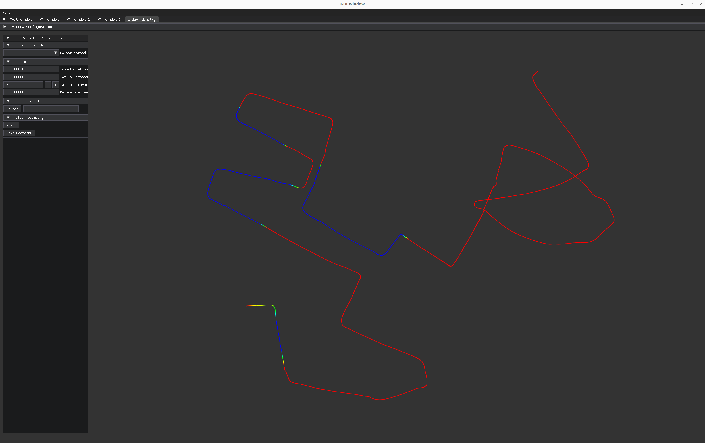

# Multi Method Lidar Odometry with GUI

> **Multi Method Lidar Odometry** is a lightweight Lidar Odometry library based on [viz3d](https://github.com/pierdell/viz3d), a C++ GUI library that integrates [Dear ImGUI](https://github.com/ocornut/imgui), an amazing graphical interface library for C++, [ImPlot](https://github.com/epezent/implot), which provides an interactive plotting library, and [VTK](https://gitlab.kitware.com/vtk/vtk), the Visualization Toolkit.

## Description

> This library is a simple application layer over the singleton `GUI`, which opens a `GLFW` window and manages a set of user-defined `ImGUIWindow`s.
>
> A specialized `VTKWindow` extends an `ImGUIWindow` and allows the creation and visualization of multiple VTK pipelines integrated with the ImGui-managed layout of windows. The pipelines are rendered offscreen in a texture and then copied into the available space of the window.
>
> For lidar odometry, the library integrates PCL's `NDT` and `ICP` methods to generate a lidar trajectory from imported lidar point clouds and saves them as .csv and .pcd files.

## Installation

> `install.sh` and `install.bat` provide complete installation scripts for Linux and Windows. They first install the external dependencies (VTK, GLFW, GLAD, PCL, etc.) and then build the project. The default installation destination is `./install`.

## Usage

> Run the `run.sh` file to initialize the UI.
>
> - To run lidar odometry, first select a folder that contains .pcd files of lidar point clouds.
> - If you have a ROS2 bag file, you can import your PointCloud2 topics as .pcd files using [this script](https://github.com/enescingoz/ros2bag_to_pcd).
> - After choosing the folder with .pcd files, select your registration method and set the required parameters for that method.
> - Once you click the `Start` button, your selected registration method will be initialized and a trajectory will be generated and visualized on the UI.
> - To save the generated trajectory as .csv and .pcd files, click the `Save odometry` button and choose an output path.
>
> See `main.cpp` for more details.

> The interactor style used for each VTKWindow is [vtkInteractorStyleMultiTouchCamera](https://vtk.org/doc/nightly/html/classvtkInteractorStyleMultiTouchCamera.html), which works as specified below:
- `Left Mouse Button Pressed`: Rotates the camera
- `Shift Key` + `Left Mouse Button Pressed`: Translates the camera (Pan)
- `Ctrl Key` + `Left Mouse Button Pressed`: Rotates the camera

## TODO(s)
- [ ] Implement `ICP-N`, `ICP-NL`, and `GICP` registration methods from the PCL library
- [ ] Show log messages on the UI
